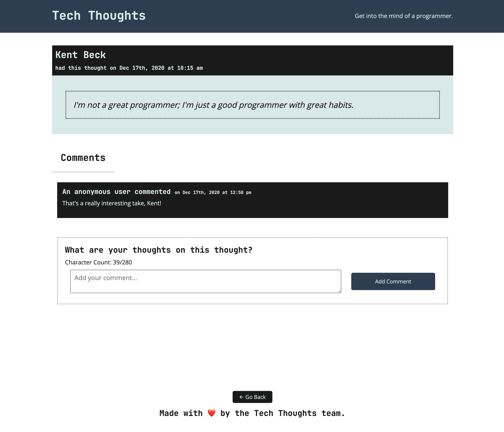

# 🏗️ Tech Thoughts Single-Page Application

* As a user, I want to view individual thoughts and a list of comments.

* As a user, I want to be able to bookmark a thought's page so I can come back and read more comments.

## Comments

* When I select a thought on the homepage, I am taken to that thought's page to view its comments without reloading the page.

* When I visit the thought directly in the browser, I am taken to that thought's page to view its comments.

## Assets

The following screenshot demonstrates the web application's appearance and functionality:

